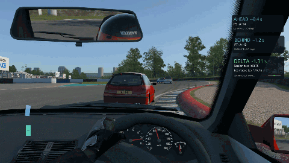

# lfs-openradar

OpenRadar is a standalone overlay for Live for Speed with a proximity radar,
a speed and indicator dashboard, estimated gaps to the cars ahead and behind,
and a real-time performance delta
against your best clean lap in the current session. Each gadget has its own
window, position, scale, and visibility settings.

It connects to your local LFS client through InSim, OutSim, and OutGauge. Regular players
can use it in multiplayer without the server's admin password. Windows is the
primary platform; Linux/X11 support is experimental.

> [!NOTE]
> I’m building this project with plenty of AI help behind the scenes.
> I have mixed feelings about LLMs, but they help me keep development moving
> and spend more time racing.

## Quick preview

Live preview. Yes, we need more pixels.

## Features

- Proximity radar
- [Speed, gear, RPM, and warning indicators](docs/configuration.md#speed-dashboard)
- Real-time gap ahead/behind indicator
- Lap performance delta

## Table of contents

- [Installation](docs/installation.md): downloads, first configuration, and connecting LFS.
- [Usage](docs/usage.md): quick start, gadget behavior, and platform status.
- [Development](docs/development.md): prerequisites, building, and testing.
- [Configuration](docs/configuration.md): config paths, passwords, and telemetry settings.
- [LFS startup setup](docs/lfs-startup-setup.md): automatic InSim, backups, and port conflicts.
- [Troubleshooting](docs/troubleshooting.md): connection, positioning, and graphics issues.
- [CI and releases](docs/ci-and-releases.md): checks, version bumps, builds, and recovery.
- [Product roadmap](docs/roadmap.md): planned widgets and architecture.
- [v0.2 release notes](docs/release-notes-v0.2.md) and [historical release plan](docs/release-v0.2.md).
- [Radar implementation plan](docs/proximity-radar-plan.md): telemetry research and acceptance criteria.
- [Graphics freeze investigation](docs/graphics-freeze-investigation.md): evidence and mitigations.
- [Contributing](#contributing)
- [License](#license)

## Contributing

Open an issue for bugs or feature proposals, or submit a PR from a feature
branch. Include the problem, the resulting behavior, and how you checked it.
For overlay issues, include your OS, GPU/driver, LFS version, display mode, and
relevant graphics-log output. Remove passwords from any shared configuration.

Run the [development checks](docs/development.md#testing) and update
documentation when behavior or configuration changes. Keep changes to the
vendored eframe patch documented in
[its patch notes](vendor/eframe/OPENRADAR-PATCH.md).

Release versions must match in Cargo.toml and Cargo.lock. A higher version
merged into `main` triggers automatic tags, release notes, and Windows/Linux
downloads; unchanged versions skip publication. See
[CI and releases](docs/ci-and-releases.md) for the release process.

## License

OpenRadar is licensed under the [MIT License](LICENSE). The vendored eframe patch
includes its own [MIT license](vendor/eframe/LICENSE-MIT) and
[patch documentation](vendor/eframe/OPENRADAR-PATCH.md).
