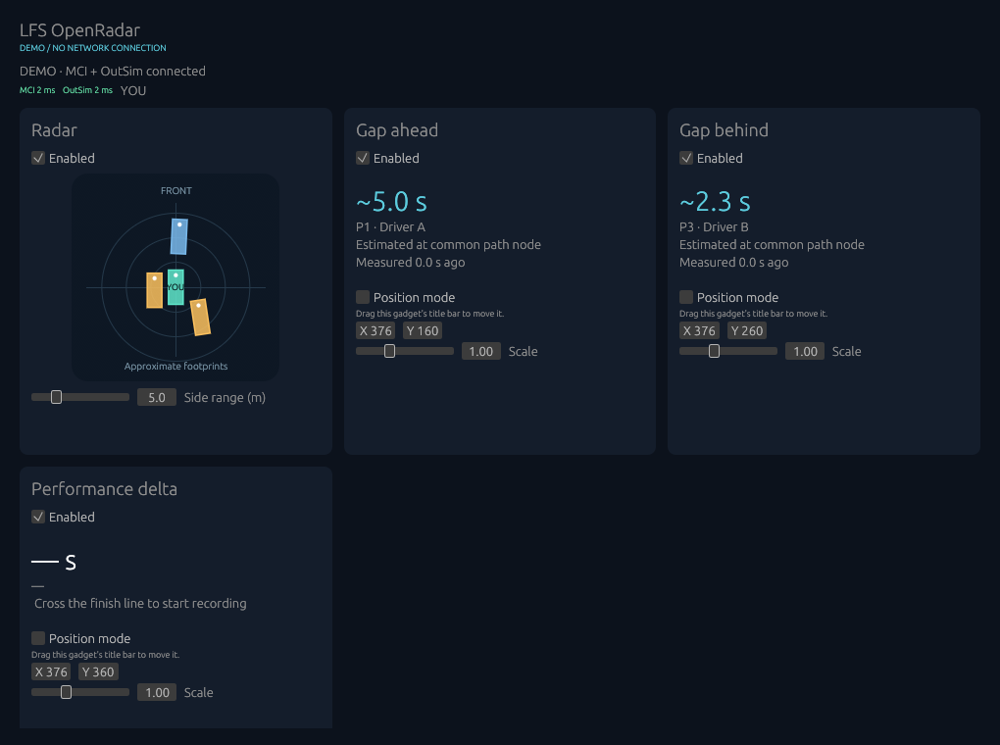

# lfs-openradar

OpenRadar is a standalone overlay for Live for Speed with a proximity radar,
estimated gaps to the cars ahead and behind, and a real-time performance delta
against your best clean lap in the current session. Each gadget has its own
window, position, scale, and visibility settings.

It connects to your local LFS client through InSim and OutSim. Regular players
can use it in multiplayer without the server's admin password. Windows is the
primary platform; Linux/X11 support is experimental.

## Quick preview



Synthetic demo with all gadgets enabled. The delta needs a fully recorded lap
before it can show a comparison.

<!-- Replace the preview image with an animated GIF when available. -->

## Features

- Proximity radar
- Real-time gap ahead/behind indicator
- Lap performance delta

## Usage

After completing [installation and first configuration](#install), launch
OpenRadar from the folder containing your configuration:

```powershell
.\lfs-openradar.exe
```

On Linux, use `./lfs-openradar`. To preview the app without LFS or network sockets,
add `--demo`; when running from source, use `cargo run --locked -- --demo`.

1. Start LFS and drive your own car in cockpit or custom view. Confirm that the
   MCI and OutSim age indicators are updating.
2. Enable **Show overlays** in **Settings**, then enable the cards you want
   in **Gadgets**.
3. Enable a gadget's **Position mode**, drag its title bar or adjust X/Y, then
   turn Position mode off to restore the transparent, click-through overlay.
4. Adjust size or scale and click **Save settings** to keep your placement.
   Use **Apply / reconnect** after changing connection or telemetry settings.

The gaps compare adjacent **race-order** drivers on standard circuit layouts.
The performance delta becomes available after a clean, fully recorded reference
lap: negative/green means ahead, positive/red means behind. **GAINING / LOSING**
shows the recent change. Gaps and delta are estimates; stale or unsuitable
telemetry shows unavailable.

Keep the control panel open; closing it exits OpenRadar. Windows can hide the
overlays when LFS is in the background. Windowed or borderless LFS is the initial
target. See the [usage guide](docs/usage.md) for gadget behavior, reference-lap
rules, platform limitations, and graphics diagnostics.

## Install

### Download

Download the Windows x64 ZIP or experimental Linux x64 tar.gz from
[GitHub Releases](https://github.com/ernowo-git/lfs-openradar/releases), then
extract it into a writable folder. Archives include the example configuration
and documentation. Raw executables are also available.

Windows requires the Microsoft Visual C++ x64 runtime. Linux requires glibc 2.35
or newer, X11 libraries, and suitable Vulkan/OpenGL drivers. See the
[runtime requirements](docs/release-notes-v0.2.md#downloads-and-startup) and
[platform status](docs/usage.md#platform-status). Wayland, Gamescope, and exclusive
fullscreen overlay behavior remain unverified.

### First configuration

Copy [openradar.example.toml](openradar.example.toml) to `openradar.local.toml`
in your extracted application folder:

```powershell
Copy-Item openradar.example.toml openradar.local.toml
```

On Linux, use `cp openradar.example.toml openradar.local.toml`.
Launch from this folder, or set a Windows shortcut's **Start in** to it.
The default config location is the **working directory**, which can differ
from the executable's folder.

You can store the config elsewhere by passing an existing file explicitly:

```powershell
.\lfs-openradar.exe --config "C:\MySettings\openradar.local.toml"
```

**Save settings** writes to that same path. Without `--config`, a missing default
file uses built-in defaults and is created when you save. See the
[configuration guide](docs/configuration.md) for all settings and overrides.

### Connect LFS

1. Open **Settings → LFS startup setup** in OpenRadar, select the folder containing
   `LFS.exe`, and click **Enable InSim at startup**. Restart LFS to activate it.
   For the current session only, type `/insim 29999` in LFS instead.
2. With LFS closed, configure OutSim in its `cfg.txt` to match the defaults below,
   then restart LFS. The startup setup button configures InSim only.

```text
OutSim Mode 1
OutSim Delay 2
OutSim IP 127.0.0.1
OutSim Port 30000
OutSim ID 24601
OutSim Opts 1ff
```

3. If your local LFS client has a **Game Admin** password, enter it in the masked
   **InSim password** field and click **Apply / reconnect**. Saving settings
   stores the password as plain text in your TOML file.
4. Drive your own car and confirm both telemetry sources are updating.

See [LFS startup setup](docs/lfs-startup-setup.md) for backups and port conflicts,
or [troubleshooting](docs/troubleshooting.md) if the overlay stays paused.

### Build from source

Use Rust 1.88 or newer and keep the checked-in Cargo.lock and `vendor/eframe`
directory. Windows needs Visual Studio C++ Build Tools and a Windows SDK.
Linux needs a C/C++ compiler, pkg-config, and X11/Wayland development libraries;
the [CI workflow](.github/workflows/ci.yml) lists the Ubuntu dependencies.

```text
cargo build --release --locked
cargo run --locked -- --demo
```

The executable is placed in `target/release/`.

## Testing

Run the local Rust checks before submitting code changes:

```text
cargo fmt --check
cargo check --locked
cargo clippy --all-targets --locked -- -D warnings
cargo test --locked
cargo test --no-default-features --locked
```

The tests cover telemetry packets, socket behavior, geometry, lap-reference
validity, and startup-script changes. For a demo check without graphics or LFS:

```text
cargo run --no-default-features --locked -- --demo --headless --seconds 3
```

Release automation has a separate Python 3.11+ test suite:

```text
python -m unittest discover -s .github/scripts -p "test_*.py" -v
```

GitHub Actions checks PRs on Windows and Linux. Synthetic tests do not replace
live driving checks for timing accuracy, transparency, click-through, monitor
changes, and Linux/Wine/Proton behavior. See the
[acceptance criteria](docs/proximity-radar-plan.md).

## Contributing

Open an issue for bugs or feature proposals, or submit a PR from a feature
branch. Include the problem, the resulting behavior, and how you checked it.
For overlay issues, include your OS, GPU/driver, LFS version, display mode, and
relevant graphics-log output. Remove passwords from any shared configuration.

Run the checks above and update documentation when behavior or configuration
changes. Keep changes to the vendored eframe patch documented in
[its patch notes](vendor/eframe/OPENRADAR-PATCH.md).

Release versions must match in Cargo.toml and Cargo.lock. A higher version
merged into `main` triggers automatic tags, release notes, and Windows/Linux
downloads; unchanged versions skip publication. See
[CI and releases](docs/ci-and-releases.md) for the release process.

## Other docs

- [Usage guide](docs/usage.md): gadget details, platform status, and graphics diagnostics.
- [Configuration](docs/configuration.md): config paths, passwords, and telemetry settings.
- [LFS startup setup](docs/lfs-startup-setup.md): automatic InSim, backups, and port conflicts.
- [Troubleshooting](docs/troubleshooting.md): connection, positioning, and graphics issues.
- [CI and releases](docs/ci-and-releases.md): checks, version bumps, builds, and recovery.
- [Product roadmap](docs/roadmap.md): planned widgets and architecture.
- [v0.2 release notes](docs/release-notes-v0.2.md) and [historical release plan](docs/release-v0.2.md).
- [Radar implementation plan](docs/proximity-radar-plan.md): telemetry research and acceptance criteria.
- [Graphics freeze investigation](docs/graphics-freeze-investigation.md): evidence and mitigations.

## License

OpenRadar is licensed under the [MIT License](LICENSE). The vendored eframe patch
includes its own [MIT license](vendor/eframe/LICENSE-MIT) and
[patch documentation](vendor/eframe/OPENRADAR-PATCH.md).
