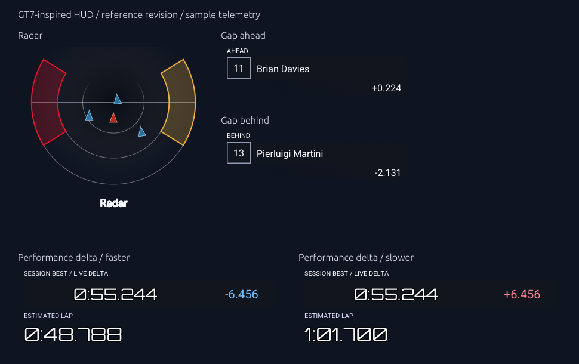

# Usage guide

## Quick start

After completing [installation and first configuration](installation.md), launch
OpenRadar from the folder containing your configuration:

```powershell
.\lfs-openradar.exe
```

On Linux, use `./lfs-openradar`. To preview the app without LFS or network sockets,
add `--demo`; when running from source, use `cargo run --locked -- --demo`.

1. Start LFS and drive your own car in cockpit or custom view. Confirm that the
   MCI and OutSim age indicators are updating.
2. Enable **Show overlays** in **Settings**, then enable the cards you want
   in **Gadgets**. On Windows, press **Insert** to toggle all overlays while driving.
   Change `overlay_toggle_key` in your TOML file to use another key.
3. Enable a gadget's **Position mode**, drag its title bar or adjust X/Y, then
   turn Position mode off to restore the transparent, click-through overlay.
4. Choose **Classic** or **GT7-inspired** under **HUD style** in **Gadgets**.
   Adjust size or scale and click **Save settings** to keep your placement and style.
   Use **Apply / reconnect** after changing connection or telemetry settings.

For hands-free debugging, start a single-player AI race, watch an AI in cockpit
or custom view, enable **Follow viewed car**, then click **Apply / reconnect**.
Radar, gaps, and delta follow that driver. Changing drivers clears the lap
reference. Disable **Hide overlay when LFS is in background** to watch the
overlay while debugging in another window. See [follow-view usage](#follow-viewed-car).

The gaps compare adjacent **race-order** drivers on standard circuit layouts.
The performance delta records a full reference lap from the finish line.
In a race, recording starts at the beginning of lap 2; after a clean lap 2 is
confirmed by LFS, comparison starts on lap 3.
Negative/green means ahead; positive/red means behind. **GAINING / LOSING** shows
the recent change. **Estimated lap** projects the current lap's finish time
using the session-best reference and live delta.
Gaps, delta, and projected lap times are estimates; stale or unsuitable telemetry
shows unavailable.

Keep the control panel open; closing it exits OpenRadar. Windows can hide the
overlays when LFS is in the background. Windowed or borderless LFS is the initial
target. See [platform status](#platform-status) for platform limitations and
[graphics diagnostics](#graphics-diagnostics) for troubleshooting details.

## HUD styles

Choose **Classic** or **GT7-inspired** from **HUD style** at the top of the
**Gadgets** tab. Radar, gaps, and delta change immediately, and their cards preview
the selected appearance. Speed dashboard and Fuel retain their reference designs
in either style. Click **Save settings** to remember the selection;
reconnecting LFS is unnecessary. Positions, scales, enabled gadgets, and
position mode are retained. Classic remains the default for existing files.

GT7-inspired uses transparent backgrounds, boxed driver positions, fading gap
rows, digital reference-time and signed delta cells, and a larger estimated-lap
readout. It also adds a red directional player marker, blue opponent markers,
and pale radar guides. Left/right sectors of the outer circle indicate nearby
or alongside cars in amber and potential contact in red; gray indicates uncertain
telemetry. The strongest warning appears on each occupied side, and opponent
borders stay blue. Faster lap deltas use a blue cell and slower deltas use a red
cell, both with white text. The best and estimated lap values use Azeret Mono.

The theme is inspired by GT7's HUD; telemetry and calculations still come from LFS.
The session-best time is the reference lap; the adjacent delta is the live
comparison against it. The estimated lap appears beneath the timing cells,
without a BEST badge, trend meter, or gaining/losing footer. Ahead intervals
display `+`, behind intervals display `−`. Enable **HUD debug information** in
the Gadgets tab to show gap diagnostics such as **Building passage history**
and **ESTIMATE** with measurement age. They are hidden by default in both
Classic and GT7-inspired. The reference time and signed intervals
use milliseconds; this display precision does not change telemetry accuracy.

GT7 colors, cell sizes, borders, offsets, and type sizes are centralized in
[`gt7_style.rs`](../src/overlay/gt7_style.rs). Gap windows use a base size of
320 × 106 logical pixels, and delta uses 440 × 132 before your scale is applied.
Roboto and Azeret Mono are embedded for this theme, with
[font licenses](font-licenses.md) included in release archives. Radar's cosmetic
vertical strip remains removed.

The proximity radar follows the supplied animated reference: three arcs fading
toward the top, a horizontal guide, compact
directional markers, and a bottom **Radar** label. Marker size is configurable
through `RADAR.proximity.marker_size` and scales with the radar window. The
symbols show live car locations and headings; they are not physical car
footprints. The arcs are decorative guides, not a track map or metre markings.
The blue panel backing is disabled so the HUD floats over the game. Radar has
a radial black-to-grey background, with **40% opacity at the centre** fading to
**0% opacity at the outer circle**. Edit the colors and `center_opacity` /
`edge_opacity` in `RADAR.proximity.background`; set it to `None` for a fully
transparent radar background. Gap position/name rows and reference/live-delta
cells use `CELL_BACKGROUND` in `gt7_style.rs`: neutral grey-black at 30% opacity.
Gap interval rows fade from transparent to the same 30% backing. Radar sector
size, fill opacity, outline, and warning colors are editable through
`RADAR.proximity.side_warnings`: `inner_radius` controls thickness as a fraction
of the outer circle, and `half_angle` controls half the angular span in radians.

The current overlay renderer composites transparency without backdrop blur.
Windows' documented [DWM system backdrop API](https://learn.microsoft.com/en-us/windows/win32/api/dwmapi/ne-dwmapi-dwm_systembackdrop_type)
requires Windows 11 build 22621+ and applies its material across the window.
Blur confined to these cells would require additional native compositor
integration; this theme uses the requested grey-black fallback.



The preview uses the actual gadget painters at their base sizes, with sample
driver/timing values to show both faster and slower delta states.

## Follow viewed car

To debug with real driving telemetry while LFS drives for you:

1. Start a live **Single Player** race with several AI drivers on a standard circuit.
2. Press **Tab** to select an AI, then **V** to select cockpit or custom view.
3. Enable **Follow viewed car** in the control panel and click **Apply / reconnect**.
   Click **Save settings** to remember it.
4. Confirm the panel shows the followed driver's name and both telemetry ages
   update. Radar uses that car as its origin; gaps use its race-order neighbors.
5. Stay on that AI through a full clean recorded lap to establish its delta
   reference. Switching drivers clears the reference, including between AI cars
   of the same model. Returning to an earlier driver starts a new reference.

Pause and unsupported cameras hide live output and discard the unfinished lap.
Returning to the same surviving car retains its best clean reference. A race
restart, track change, disconnect, or driver replacement clears the reference.
The AI needs a usable path; use a standard circuit for gaps and delta.

Disable **Hide overlay when LFS is in background** to keep the overlays visible
while working in your debugger. LFS must also keep running when it loses focus;
if telemetry stops, check whether the game paused.

The option defaults off. Multiplayer still uses your own human-driven car,
even with the option enabled; remote-car following is unavailable. Replays
remain unsupported. OutSim and InSim must both supply matching, fresh data.

## Control panel and gadget grid

The **Gadgets** tab presents Radar, Speed dashboard, Gap ahead, Gap behind,
Performance delta, and Fuel
cards in insertion order. Cards fill each row from left to right, wrap to the left of the next row
when another card cannot fit, and reflow when the window is resized. Narrow
windows use one column; extra rows are vertically scrollable. The panel opens
with space for the cards and fits its height to the rendered controls,
within the monitor's available size. The initial width is fitted before the
window appears. You can resize it afterward.

The header keeps **Apply / reconnect**, **Save settings**, **Quit**, and connection
status visible on either tab, including when the content is scrolled. Apply is
disabled in the demo, which has no network connection. The **Settings** tab holds
**Show overlays**, background hiding, interpolation, the InSim password, and
**LFS startup setup**. Radar position mode, X/Y, size, and side range are inside
the Radar card.

**Interpolation (ms)** smooths radar motion by displaying slightly older
telemetry between received updates. Higher values can reduce jitter but add
display delay. The default is 60 ms; 0 ms uses the latest time shared by MCI
and OutSim. It does not predict future positions. Click **Apply / reconnect**
after changing interpolation in live mode.

Each gadget has a separate transparent overlay window.
Enable the gap gadgets from their cards, turn on each card's **Position mode**,
and drag that gadget's title bar anywhere on the desktop. Turn Position mode off
to restore its borderless, mouse click-through display. Each gap also has screen
X/Y controls, a **Move gadget** handle in Position mode, and a Scale control.
**Save settings** persists each window's screen coordinates and scale.
Existing TOML files retain their radar settings and default to radar enabled,
with both new gap gadgets disabled. Earlier normalized gap X/Y values are
migrated to screen coordinates; future saves use `window_x` and `window_y` in
logical screen pixels. Fresh gap windows start to the right of the radar.
When a gadget window first opens, its size and position are fitted to a connected
monitor. Off-screen saved positions return to the primary monitor; valid positions
on secondary monitors, including negative X/Y, are retained.

**Show overlays** controls all windows, and each card's Enabled setting controls
its own gadget. Closing a gadget window in Position mode disables that gadget.
Press **Insert** to toggle **Show overlays**. On Windows this also works while
LFS has focus; on other desktop backends the control panel must have focus.
Holding the key toggles once until you release it. The shortcut uses an
unmodified key and follows the same background-hiding and Position mode rules
as the checkbox. Individual gadget Enabled settings and telemetry recording
are preserved when all overlays are hidden.

To change the shortcut, edit this top-level setting in your TOML configuration
and restart OpenRadar:

```toml
overlay_toggle_key = "Insert"
```

Supported names are `Insert`, `Delete`, `Home`, `End`, `PageUp`, `PageDown`,
`Space`, `Enter`, `Escape`, `Tab`, `Backspace`, `F1` through `F24`, letters `A`
through `Z`, and digits `0` through `9`. Names are case-insensitive. For example,
use `"F8"` to change the key or `"None"` to disable the shortcut. Existing
configuration files that omit this setting default to `"Insert"`.

The radar retains its own size and position when gaps are enabled or moved.
All windows share one telemetry connection, but repaint independently; hidden
windows keep their existing graphics surfaces for reuse. Background hiding
applies to each window, with its own Position mode allowing placement outside LFS.

Gaps compare the immediately preceding/following **race-order** driver, including
AI, rather than the nearest car on the radar. Both show the driver, race position,
an estimate such as `~5.0 s`, and the measurement age. Lapped neighbors show lap
separation. This first implementation supports races with standard track timing;
practice/qualifying rankings and custom/open timing layouts show unavailable.

The existing InSim connection requests track node count and finish-node metadata.
For each complete MCI set, the gap engine keeps up to 30 seconds of node-passage
history (also capped at 3,100 passages per car). It compares both cars' passage
times at the trailing car's latest crossed node, matching lap identity across the
finish line. Skipped-node times are interpolated between updates. No distance
divided by speed or forward prediction is used. Values update as nodes are
crossed; arrival timestamps, node spacing, and network delay limit accuracy.

Missing history, unknown/tied race positions, lagging/out-of-path cars, backwards
progress, resets, and stale or mismatched telemetry withhold seconds. A crossing
older than two seconds is unavailable until progress resumes. Both gadgets share
the current local-driver/OutSim association gate. Live two-car validation against
LFS timing remains required; synthetic checks do not establish live accuracy.

For a native preview with both gaps enabled, create a TOML file with
`[gap_ahead]` and `[gap_behind]` sections containing `enabled = true`, then run:

```text
cargo run -- --demo --config YOUR_CONFIG.toml --seconds 12 --screenshot gadgets-preview.png
```

Gap-enabled screenshots wait up to six seconds for the demo passage history;
shorter timed runs capture earlier. The deterministic demo settles at `~5.0 s`
ahead and `~2.3 s` behind.

## Live performance delta

Enable **Performance delta** and **Show overlays** in the control panel. Its own
**Position mode**, X/Y, and Scale controls work like the gap gadgets. Save settings
to persist placement. Existing configurations default to this gadget disabled.

After crossing the finish line, complete a clean, fully recorded lap to establish
your session-best reference. In a race, recording starts at the beginning of
lap 2 and comparison becomes available on lap 3 after LFS confirms a clean lap 2.
The first partial lap after connecting or leaving the pits cannot qualify.
Practice and qualifying also record a full lap from a finish-line crossing.
The display compares elapsed time at matching track
progress on every complete MCI update (normally every 20 ms), with spatial
interpolation between reference nodes. Negative/green means ahead; positive/red
means behind. **GAINING / LOSING / STEADY** and the small bar show the recent change
in delta, independently of whether you are ahead overall.

**Estimated lap** shows the projected current lap time in minutes and seconds.
It is the reference lap time plus the live delta.
It assumes the remaining track is driven at the reference pace. It shows a dash
until comparison is available, and while paused, invalid, or telemetry is stale.

The reference stays fixed during a lap and updates after a faster clean lap is
confirmed by LFS's lap-completion packet. Track-limit/wall/pit-speed violations,
pit stops, penalties, resets, and backwards/discontinuous progress prevent a lap
becoming a reference. Pitting or changing
views retains the best reference for the same driver and car, but restarts
recording. Track, layout, car, session changes and reconnects clear the reference.
References are session-only and are not written to disk.

Brief lag, missing car updates, or mismatched OutSim samples hide live values
while retaining validated lap and gap history in memory. Timing resumes if
matching telemetry returns within 500 ms with continuous progress. Longer gaps
discard the current recording but retain an established session reference.
Other drivers' pit stops, resets, and roster refreshes preserve your timing
history. Recording starts, interruptions, resets, and accepted references are
logged in `openradar.graphics.log` beside the configuration file.

Standard circuit timing is supported in practice, qualifying, and races. Open
and custom timing layouts show unavailable. Values are explicitly estimates:
MCI has no per-car physics timestamp, and node spacing, racing-line differences,
and network arrival timing affect accuracy. Stale telemetry withholds the delta.
Live driving validation remains required. The demo records a 100-second reference
lap after its first finish crossing; the delta becomes available after 200 seconds.

```toml
[performance_delta]
enabled = true
window_x = 376.0
window_y = 360.0
scale = 1.0
```

## Run

From this folder:

```text
cargo run -- --demo
cargo run
```

The demo opens the control panel and an animated overlay without opening any
network sockets. Live mode opens the control panel and connects to the local LFS
client. Enable **Show overlays** when ready. **Radar position mode** adds a normal
border/title bar to the radar; drag its title bar to move it. Turn position
mode off to restore the borderless, mouse click-through radar with a transparent
background. Position mode retains the dark radar backing for placement; the
control-panel preview also keeps its backing. The **Move radar**
handle and **X/Y** controls in the control panel remain available as alternatives.
**Radar size** applies once dragging stops and the value has
settled for 250 ms. **Side range (m)** changes zoom immediately throughout
0–12 metres in both themes. Classic zooms uniformly: distance guides remain
circular and car footprints keep their proportions. At tight zoom, distant
front/rear cars can be outside the visible square; front/rear settings still
control detection. GT7 adjusts horizontal placement independently, keeping
vertical placement stable, compact arrow symbols, and decorative circular guides.
Zero is a valid side range; detection still includes car-footprint padding.
Use **Save settings**
to write the configuration file used at launch (see [Configuration](configuration.md)). Use **Apply / reconnect** after changing live
settings, including interpolation and detection range.

Windows foreground detection hides each overlay when LFS.exe is not active,
unless that gadget's position mode is enabled. Keep the control panel open; closing it exits
the radar and releases its sockets.

Windows rendering uses DX12 with a DirectComposition visual swapchain for
background transparency. The vendor patch disables the ordinary opaque Windows
redirection bitmap when creating transparent DirectComposition windows.
Alpha support is enabled on the shared renderer;
the control panel still paints an opaque background. Other platforms retain
default wgpu backend selection. Windows builds select this path explicitly,
overriding `WGPU_BACKEND` and `WGPU_DX12_PRESENTATION_SYSTEM`.

For paused output, positioning, redraw problems, connection errors, or graphics
freezes, see the [troubleshooting guide](troubleshooting.md).

## Platform status

- **Windows:** native build, demo rendering, and mock TCP/UDP telemetry are
  exercised during development. Live LFS alignment, input pass-through over the
  game, DPI behavior, and orientation smoothness still need driving tests.
  Release executables require the Microsoft Visual C++ x64 runtime; see the
  [v0.2 release notes](release-notes-v0.2.md) for the official download.
- **Linux/X11:** the x64 release build, automated tests, and an Xvfb/Vulkan
  software-rendered demo pass in an Ubuntu 22.04 environment under WSL. The
  candidate requires glibc 2.35 or newer. Live LFS through Wine/Proton, overlay
  transparency, stacking, positioning, and click-through over a game still need
  acceptance testing. Running the binary needs X11 libraries and working
  Vulkan/OpenGL drivers. Building from source additionally needs a C/C++
  compiler, pkg-config, and X11/Wayland development libraries.
- **Wayland:** reliable stacking above a game needs compositor-specific work or
  a layer-shell backend. The current ordinary-window prototype does not promise
  this support.
- **Exclusive fullscreen / Gamescope:** unverified.

Foreground detection is implemented on Windows only. Other desktops expose
manual overlay visibility. Windowed/borderless LFS is the initial target.

## Graphics diagnostics

Desktop launches append to `openradar.graphics.log` beside the chosen TOML path.
The log records the selected GPU/backend/driver, overlay toggles, settled size
changes, and graphics warnings/errors. It excludes telemetry and passwords and
is capped at 1 MiB; it resets on a later launch when almost full. Timestamps are
Unix milliseconds. Headless mode does not initialize the graphics stack.
If the overlay keeps painting while the panel has not repainted for five seconds,
the log records that observation once and records when panel painting resumes.
This may also happen when a panel is deliberately minimized or obscured.

After two reported hard freezes during position/range editing on this machine,
Windows recorded matching GPU engine timeouts and AMD driver reports. Native
window handling was changed to avoid resize storms, position feedback commands,
and surface destruction/recreation when hidden. Decorations now change only
when toggling position mode. The control
panel and overlay now render as separate deferred viewports. These are
mitigations; GPU-free automated checks cannot certify driver stability. See
[the investigation](graphics-freeze-investigation.md) for evidence and limits.

The overlay reads the telemetry worker's latest snapshot on every repaint and
schedules its own refresh. It does not rely on control-panel repainting to leave
the paused state or notice missing telemetry. Demo mode also advances its own
dual-source simulation when painting the overlay.

Windows builds use a local eframe 0.33.0 patch to retain missed native redraw
requests and service them when another window paints. This addresses the
reported overlay that updated only while resizing, and repaint loss when focus
changes between windows. The patch has a soft catch-up time budget and changes
no Windows driver settings. Its source/provenance and limits are documented in
[vendor/eframe/OPENRADAR-PATCH.md](../vendor/eframe/OPENRADAR-PATCH.md); keep the vendor
directory when copying the project. The user reported success with the redraw
and positioning fixes on this Windows setup on 2026-10-06. Broader driving and
platform acceptance checks below remain outstanding.

The vendored wgpu integration also routes screenshot readbacks to their
originating viewport on every platform. This prevents another overlay from
consuming the control-panel screenshot while multiple gadgets are enabled.

## Source layout

```text
src/
  main.rs              CLI and application startup
  config.rs            Validated TOML settings
  demo.rs              Synthetic dual-source preview
  runtime.rs           Socket worker, reconnect, latest-frame publication
  lfs/insim.rs         TCP framing, handshake, roster/lifecycle, MCI sets
  lfs/outsim.rs        OutSim layout validation and decoding
  radar/mod.rs         Source association, interpolation, footprint geometry
  overlay/desktop.rs   Control panel and transparent radar window
  overlay/mod.rs       Platform foreground detection
tests/                 Protocol, geometry, and socket integration checks
```

Research and remaining acceptance criteria:
[docs/proximity-radar-plan.md](proximity-radar-plan.md). Future product scope:
[docs/roadmap.md](roadmap.md).

## Fuel

Enable **Fuel** in Gadgets and [configure OutGauge](configuration.md#speed-dashboard).
The independent window follows the supplied Fuel design, with the same background
as Speed dashboard. Its card provides position, scale, and status. Current fuel
is shown as tank percentage.

**LAPS UNTIL EMPTY** uses the average fuel consumed per complete usable lap.
The signed number beside it subtracts the estimated race distance remaining:
**12.9** fuel laps with **20.6** laps remaining gives **−7.7**, meaning you need
enough additional fuel for about 7.7 laps. A positive margin means a surplus.

The table uses up to the five most recent usable full laps:

| Field | Meaning |
| --- | --- |
| USAGE | Tank percentage consumed per lap: AVG mean, MAX highest, MIN lowest positive consumption. |
| LAPS | Current fuel divided by that row's consumption. |
| REFUEL | Additional tank percentage needed to finish using that row's consumption, rounded upward to a whole percent. |

REFUEL is the amount to **add**. An asterisk means the additional amount exceeds
the current tank space, so it requires multiple stops. The pump badge uses the
AVG laps until empty: green above 2 laps, yellow above 1 through 2 laps, and red
at 1 lap or less (refuel this lap). It stays grey while the range is unavailable;
an empty tank is red immediately. The signed race shortfall is shown separately.

Live percentage appears before calibration. Usage and range stay **—** until
two finish-line readings span a full usable lap; the partial lap after connecting
is discarded. Pit/refuel laps, resets, stale samples, and discontinuous progress
are excluded. Refuelling retains completed consumption history for the same car
and session. Changing cars, starting a new race, or reconnecting starts learning
again. Pausing temporarily preserves completed history for the same car.

Range learning requires a standard circuit. Finish margin and REFUEL are
available for lap-count races; practice and timed races leave them unavailable.
The initial estimate covers the selected driver's full configured distance. It
can overestimate a lapped driver's requirement if their race ends after the
leader finishes. Estimates depend on changing pace and approximate path-node
progress; live LFS precision and start/finish conventions still need driving
validation. Stale fuel is withheld rather than presented as current.
